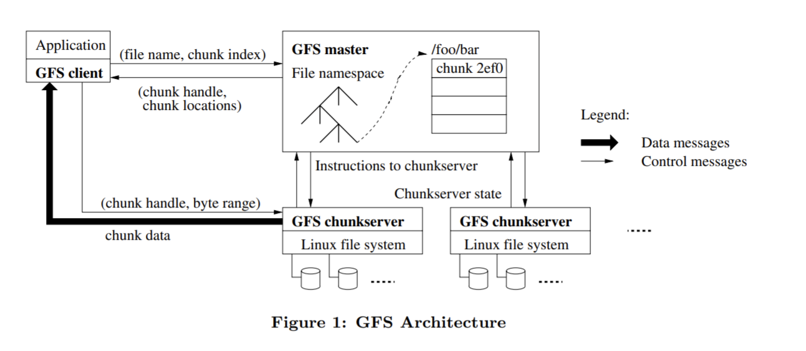

# 设计报告

------

## 1. 总体架构

项目分为前端、后端和分布式文件系统，前端和后端通过websocket通信，后端和文件系统通过rpc通信

分布式文件系统架构方式为 client/server 的架构。其中包含了 Master 节点集群和Chunkserver 节点集群

 Master 节点利用 zookeeper 进行并发控制，并且自主管理整个文件系统的元数据，而Chunkserver 节点用于管理文件内容。各个不同的节点之间通过 RPC 进行数据的交换以及访问、同步等等

 整个系统完全没有使用数据库等中间件，后端将每个文件的基础信息直接存储在gfs中，在初始化时直接读出

------

## 2. Zookeeper Cluster

&emsp;&emsp;任意位置的 lock.go 以及需要获取当前 master 中 leader 的文件中使用了 zookeeper 集群，但该集群是我搭建在租赁的服务器上，使用时应当自己搭建一个 zookeeper，并将路由和端口改成自己的 zookeeper 路径。

---

## 3. Distributed File System

&emsp;&emsp;分布式文件系统架构方式为 client/server 的架构。

&emsp;&emsp;其中包含了 Master 节点集群，Chunkserver 节点集群。

&emsp;&emsp;Master 节点利用 zookeeper 进行并发控制，并且自主管理整个文件系统的元数据，而 Chunkserver 节点用于管理文件内容。各个不同的节点之间通过 RPC 进行数据的交换以及访问、同步等等。

&emsp;&emsp;整体架构如下图：



---

### - master -

&emsp;&emsp;master 维护了一张表，保存有各个文件对应的 chunk 元数据。读写文件时，client 会先联系 master 取得目标 chunk 的位置（即位于哪个chunkserver上）以及 chunk 的 ID。然后根据 chunk location 去联系该 chunkserver 并根据 chunkId 写入或读取具体的 chunk。创建和删除文件通过 master 来帮助完成，client 只需要告诉 master 要创建或者删除什么文件即可。

#### 多master和容错

&emsp;&emsp;我们的架构中使用了其他的多个 master 作为备份。同一时刻下只有一个 master 在接受 client 请求。这个 master 称为 leader。成为 leader 的方式为，在启动时抢一把分布式锁，抢到的人就成为了 leader，并把自己的端口号保存在 zookeeper 中。client 找到 leader 的方式为，连接 zookeeper 并获得 leader 的端口号。leader 会接受所有的 client 请求，并定时的向其他未成为 leader 的 master 发送元数据以进行备份。
&emsp;&emsp;当 leader 死亡时，他会自动放锁，其他 master 会尝试获取分布式锁，抢到锁的 master 会成为新的 leader。master 间会不同的重复这样的过程。

#### 心跳机制

&emsp;&emsp;架构中，leader-master 需要尽可能的知道当前时刻其他 chunkserver 是否处于存活状态，因此 leader-master 设置了三个对应三个 chunkserver 的定时器。
&emsp;&emsp;当定时器到时的时候，该定时器对应的 chunkserver 则被 master 标记为死亡，在后续的处理中 master 会尽可能避开与该 chunkserver 的通信；当重新收到该 chunkserver 的心跳时，会重新将其标记为存活并进行正常的交互。
&emsp;&emsp;而 chunkserver 则会尽量短间隔地向 master 发送心跳 rpc，以告诉 master 他正处于存活的状态。

#### 一致性

&emsp;&emsp;leader-master 在收到 chunkserver 更新 version 的请求后都会更新表中维护的元数据，并在 client 发出读写请求的时候告知其最新 version 的 chunk 正处于哪个 chunkserver 中。
&emsp;&emsp;leader-master 会定时的向其他未成为 leader 的 master 发送元数据以进行备份。

#### 日志和错误恢复

&emsp;&emsp;master 对于与 chunk 元数据有关的操作会记录日志：例如创建、删除、增加新块。在重新启动 master 时，会根据日志的信息进行 recover。

#### 负载均衡

&emsp;&emsp;我们的 leader-master 会尽量让每个 chunkserver 负载均衡，表中维护了 chunkserver 中储存 chunk 的数目，leader-master 倾向于把新的 chunk 存放在拥有 chunk 最少的两个 chunkserver 中。

#### 效率

&emsp;&emsp;我们发现，当判断一个 master 或 chunkserver 是否存活时，通过 rpc 连接失败的方式来知晓会花费大量的时间，这是因为我们必须等待 rpc 超时后报错才能知道他们是否存活，那是一笔很大的开销，通常会让程序卡顿一到两秒。
&emsp;&emsp;因此，我们在 master 维护的表中保存了对 chunkserver 是否存活的判断(通过心跳机制)，这样来保证每次 rpc 调用时对方都是存活的，同时也在 chunkserver 中保存了 leader-master 的地址，来保证不用每次都找 zookeeper 询问，这大大降低了开销，提高了程序的运行效率。

---

### - chunkserver -

&emsp;&emsp;chunkserver 维护了一张表，保存有各个 chunk 对应的 chunk 元数据。chunkserver 管理自己的 chunk 块，并保持与其他备份的 chunk 同步，同时也会保持与 master 元数据的同步。
&emsp;&emsp;chunkserver 接受来自于 client 的读写请求，接受来自于 master 创建删除请求，这些过程中都会保持原子性，不会有同一时间内对同一个 chunk 进行更改的事情发生。

#### 备份

&emsp;&emsp;我们有多个 chunkserver 用来做备份，每个文件的每个 chunk 都会有一个备份，它们将被保存在不同的 chunkserver 上，以确保在某个 chunkserver 死亡时我们的系统仍可以正常运作。

#### 一致性

&emsp;&emsp;chunkserver在每次写文件时都会更新该 chunk 的 version ，并广播给所有 chunkserver ，让有备份的 chunkserver 也更新备份的 version。
&emsp;&emsp;同时，所有更新了本地 chunk version 的 chunkserver 都会向 leader-master 汇报，以便让 leader-master 更新自己维护的表中每个chunkserver 中 chunk 的 version。

#### 同步

&emsp;&emsp;chunkserver 在每次接受写入请求后都会告诉 leader-master 块的版本更替情况，以便及时更新 leader-master 和其他 master 关于块的元数据，同时也会将块的版本更替情况广播给其他的 chunkserver 来及时保持块副本的强一致性。

#### 日志和错误恢复

&emsp;&emsp;chunkserver 对于关键的 chunk 请求会记录日志：例如创建、删除、写入。在重新启动 chunkserver 时，会根据日志的信息进行 recover。

#### 可扩展性

&emsp;&emsp;我们允许无限地添加 chunkserver，在添加 chunserver 后，leader-master 会记录新 chunkserver 的元数据，然后让它开始正常地运作！

---

### - client -

&emsp;&emsp;webserver 作为后端，连接前端和 gfs ，对来自前端的请求调用 gfs_api 中提供的接口，包括：创建、删除、写入、读取。
&emsp;&emsp;创建和删除通过直接 rpc 调用 master 的函数来帮助创建和删除。
&emsp;&emsp;读取和写入先通过 master 获取 chunk 的具体位置和 ID。然后再去访问 chunkserver 来读取以及写入。
&emsp;&emsp;上述过程中都通过 lock.go 中的自我实现的分布式锁达到了对 chunk 操作的原子性。
&emsp;&emsp;更多有关 webserver 的信息将在下文的 gDoc backend 中给出。


---

### - 分布式锁 -

&emsp;&emsp;通过 zk 中创建节点只有一个人能创建成功的特性，实现了一个简单的自旋锁：

```go
func lock(conn *zk.Conn, chunkid string) {
retrylock:
	exist, err := exists(conn, chunkid)
	for err {
		exist, err = exists(conn, chunkid)
	}
	if !exist {
		fmt.Println("nnnnnnnnnnnotexist")
		addornot := add(conn, chunkid, "lock")
		if !addornot {
			goto retrylock
		}
	} else {
		fmt.Println("eeeeeeeeeeeexist")
		existW, errW, event := existw(conn, chunkid)
		for errW {
			existW, errW, event = existw(conn, chunkid)
		}
		if !existW {
			fmt.Println("wwwwwwwwnnnnnotexist")
			goto retrylock
		} else {
			fmt.Println("wwwwwwwwexist")
			//existW为true该怎么办
			watchCreataNode(event)
			goto retrylock
		}
	}
}

func unlock(conn *zk.Conn, chunkid string) {
	exist, err := exists(conn, chunkid)
	for err {
		exist, err = exists(conn, chunkid)
	}
	if exist {
		remove(conn, chunkid)
	}
}
```

---

## 4. gDoc frontend

#### 页面组成：
​		登录界面：用户输入用户名即可登录，并以此用户名访问系统。

​		文件列表界面：在该界面可以创建文件，查看系统的Log，切换至回收站界面以及进入文件和将文件移到回收站。

​		回收站页面：在该界面可以永久删除文件，恢复文件以及切换至文件列表界面。

​		文件界面：使用的Luckysheet组件，完成了多人协作及回滚功能。

#### 前后端通信：

​		使用websocket建立通信，在文件列表和回收站都使用websocket建立连接，消息发送和接受都使用json格式，json中的第一个属性type区别各个消息。

#### 页面实现细节：

​		**文件列表和回收站：**
点击对应按钮将打包json数据发送给后端，具体参看后端对应接口。创建删除文件需要返回是否成功，均会阻塞直到后端消息传来。

​		**文件界面：**

​				锁：前端维护了一个editLock，用来存储每一个cell的拥有者。

​				load：load阶段加载文件各个cell的数据，前端读取后，将不为空的数据写入cell。并且读入传来的lockInfo，获取现在cell被哪些用户拿锁了，然后写入editLock。

​				选中edit：用户双击进入cell进行edit，edit阶段首先会判断前端锁是否获得，如果前端维护的editLock判断锁的拥有者为其他人，将报错提醒，当前不能edit。像后端发送edit请求后，后端也会进行锁的判断，并返回成功与否，未能成功拿锁将会同样报错提醒。成功选中edit后，将向所有前端页面发送editing信息，通知这个cell的拿锁人是谁，前端页面将会把该cell设为“拿锁人” is editing 来提示该cell正在被其他人编辑。

​				update：update将把当前的值传给后端，并且放掉对应的前端锁。后端也会对应放锁，并通过websocket通知所有前端。

​				rollback：单击键盘ctrl键会触发rollback，回滚当前用户的最近一次update，发送rollback给后端，并根据返回type进行对应操作，success则将新值替换为旧值。如果返回为empty则代表没有可以rollback的了。返回错误信息分别代表rollback处已被其他人编辑过了或者正在被其他人编辑

------

## 5. gDoc backend

#### 概述

&emsp;&emsp;gDoc的后端 webserve (webserver.go) 负责接受前端的请求并与gfs进行交互以实现对应的功能

&emsp;&emsp;在后端的实现中我们没有使用额外的数据库，而是直接将文件名，文件大小等文件信息数据存储在gfs中，每次webserver初始化时直接从gfs中获取相关信息，这个特性使得我们的系统不会收到其他环境的影响，便于gDoc的部署与使用

&emsp;&emsp;配置文件中文件存储格式如下：

```
+---------+----------+-------------+----------+----------+----------+-------
  fileNum | totalLen | filenameLen | filename | filesize | validbit | ......
+----8----+----8-----+------8------+-----x----+-----8----+-----1----+-------
```

&emsp;&emsp;前16位为总体配置信息，后续信息为每个文件的配置信息：

​	 	   **整体信息**

​			fileNum: 当前所有文件的数量

​			totalLen: 配置文件的总长度

​			**单个文件信息**

​			filenameLen: 当前文件的文件名长度

​			filename: 当前文件文件名

​			filesize: 当前文件长度

​			validbit: 当前文件是否可用，为1说明可用，为0说明文件在回收站中

​			第一次启动时会创建配置文件，在 webserver 后续启动时会将配置文件的信息读出并存储到一些数据结构中

#### 接口

&emsp;&emsp;webserver通过websocket的方式与前端进行通讯

&emsp;&emsp;我们规定前端请求信息的格式为：

```go
type msgInfo struct {
	Type     string `json:"type"`
	Row      uint64 `json:"row"`
	Column   uint64 `json:"column"`
	NewValue string `json:"newValue"`
	FileName string `json:"fileName"`
	UserName string `json:"userName"`
}
```

&emsp;&emsp;在后端按照Type进行解析后进行对应的处理，并按照需求向前端发送返回值

&emsp;&emsp;具体请求种类如下：

##### connect

&emsp;&emsp;建立连接，前端在初次连接到webserver时，将前端的连接信息存储到webserver中，同时将文件列表发送给前端。

##### close

&emsp;&emsp;关闭链接，将链接信息从webserver对应数据结构中移除，同时关闭对应的websocket。

##### create

&emsp;&emsp;创建文件，通过给定的文件名在gfs中创建对应的文件，gDoc不支持创建重名文件的功能，当文件重名时拒绝创建并向前端返回错误信息。

##### open

&emsp;&emsp;打开文件，通过对应的文件名从gfs中读取对对应文件的内容并传输到前端。为保证在每个用户打开文件时都能及时的看到其他用户的编辑信息，webserver会根据锁的情况，在每个用户打开文件时将其他用户在对应文件中的拿锁情况转发给前端，保证用户一打开文件就能够看到其他用户正在编辑的信息

##### edit update

&emsp;&emsp;编辑文件与更新文件，当前端选中想要编辑的位置时，首先试图获取对应位置的写锁，若获取成功对应位置暂时没有人在编辑，获取失败说明有其他人正在编辑，此时不能编辑。锁的获取不会阻塞，获取失败后直接返回。成功获取到锁后将选中的信息发送给所有正在同时查看这个文件的用户，在对应位置设置某用户正在编辑的信息，当用户编辑完成时，通过update接口将更新信息持久化的存储到gfs中，同时释放对应位置的锁，完成对文件的更新，后端同样会对更新信息进行转发，保证其他前端能够第一时间看到更新信息。

##### lock

​	  webserver为每个文件的每个单元格加锁

&emsp;&emsp;当每个前端打开文件进行编辑时，为每个前端链接创建一个zookeeper节点，在链接断开时删除节点并释放该节点持有的所有锁。

​	  锁以每个文件的每个单元格为粒度，以“/文件名-行号-列号”作为锁的Index，当前端进行编辑时，在链接对应的节点上获取对应Index的锁，此时其他前端无法获得相同位置的锁。在前端对这个位置完成updata操作之后放锁，说明对这个位置的编辑已经结束。特别的，如果某个前端在edit阶段获取锁之后直接切断了链接，webserver会在删除链接信息的同时释放对应链接获取的所有锁，因此不会出现锁无法释放的问题

##### move to trash

&emsp;&emsp;将文件移动至回收站中，当文件没有其他用户在编辑时，可以将文件移动至回收站里。此操作并不会使文件被删除，而是暂时将文件的 valid bit 设置为 0，文件的其他信息依然处于保留的状态。只是在获取文件列表时，valid bit 为 0 的文件不会被获取。在配置文件中与文件系统中文件的信息都被完全保留。

##### recover

&emsp;&emsp;恢复文件，将文件从回收站中移除，恢复到正常的状态，此操作只需要将文件的 valid bit 设置为 1，之后文件的形式就与正常创建出的文件完全相同

##### clear trash

&emsp;&emsp;彻底删除文件，将文件从回收站中彻底删除，删除后会删除所有的文件相关信息，即会在文件系统中与配置文件中完全删除文件的相关信息，此操作不可撤回

##### log

&emsp;&emsp;webserver 会对用户的请求进行记录，包括创建文件，打开文件，编辑文件，将文件移动到回收站，恢复文件与彻底删除文件。webserver会记录进行操作的用户，操作的内容与操作的时间。前端通过调用 log 接口可将 log 内容按照执行顺序逐条读出。webserver的log文件被存放在gfs中。

##### rollback

​    webserver提供rollback接口，用户可以对文件执行回滚操作，但是考虑到多人编辑存在关于一致性的一些问题，对回滚功能增加了一些限制：

    1. 一次只能回退一步操作
       2. 特定用户只能回退自己编辑的内容
       3. 若用户编辑的内容已经被其他人修改，则不能再进行回退
       4. 希望回退的位置如果正在被其他用户编辑，则不能执行回退操作


